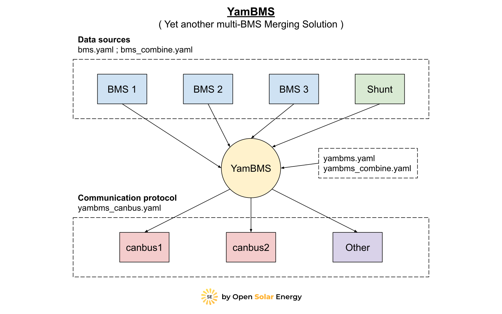
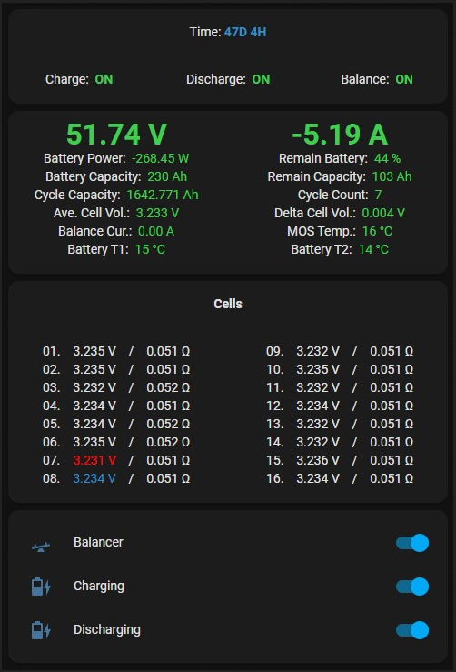

# YamBMS ( Yet another multi-BMS Merging Solution )

> [!CAUTION] 
> There is a black screen issue with `Atom S3` when you compile YamBMS with ESPHome `2024.8.0` and above. Until this bug is fixed it is necessary to compile with ESPHome `2024.7.3` (this only concerns Atom S3).

| ESPHome application to monitor BMS and communicate with inverters supporting CAN bus protocol compatible with Pylontech, GoodWe, SMA, Victron or Luxpower (EG4). |  |
| :--- | --- |
| **Note: Pylontech uses 15S/48V and many others uses 16S/51.2V !**  Other battery profiles that utilise the **`PYLON`** protocol with different cell counts may also work, e.g. Alpha Ess Smile, BYD Battery-Box LV Flex Lite. Select the correct battery profile in the inverter to match your battery pack ! The **`ESP32`** communicates with the BMS using the **`BLE / UART / RS485`** protocol and then sends the CAN bus data to the inverter via the [CAN bus transceiver](documents/README/Supported_devices.md#supported-can-bus-transceiver). |  |

**Sends over CAN bus to inverter:**
  - Battery Voltage
  - Battery Current (+charge, -discharge)
  - State of Charge (SOC)
  - State of health (SOH)
  - BMS temperature
  - Charging voltage
  - Charging max amps
  - Discharge min voltage
  - Discharge max amps
  - Battery name
  - Alarms: Cell over/under voltage, Charge/discharge over current, High/low Temp, BMS fault
  
**Note:** this code support `multi-BMS` connection per inverter with a `single ESP32` and should work with inverters that support 
the CAN bus protocol `PYLON`, `SMA`, `Victron` or `LuxPower` (EG4). I'm only testing it with my `Deye SUN-6K-SG03-LP1-EU` inverter. 
**This project is still in development and testing... **

[Dedicated topic on DIY Solar Forum](https://diysolarforum.com/threads/yambms-jk-bms-can-with-new-cut-off-charging-logic-open-source.79325/)

## YamBMS

## Home Assistant

## Contents

1) [Supported devices](documents/README/Supported_devices.md)
2) [Charging logic](documents/README/Charging_logic.md)
2) [YamBMS functions](documents/README/YamBMS_functions.md)
3) [CAN bus protocol](documents/README/CANBUS_protocol.md)
4) [Schematic and setup instructions](documents/README/Schematic_and_setup_instructions.md)
5) [Configuration of the main YAML](documents/README/Main_YAML_config.md)
6) [Installation procedure](documents/README/Installation_procedure.md)

## Requirements

* [ESPHome 2024.6.0 or higher](https://github.com/esphome/esphome/releases)
* ESP32 MCU
* CAN Transceiver (only with TJA1050/TJA1051 : 4.7K resistor for 5V to 3V3 level shifing)
* BMS JK-B*, JK-PB* (other BMS brands already integrated with ESPhome can be added easily)
* Inverters supporting CAN PYLON/Goodwe/SMA/Victron Low Voltage protocol
* Optional: 48V to 5V DC-DC converter to power the ESP32 from the JK-BMS VBAT pin (URB4805YMD-10WR3 or VRB4805S-6WR3)
* Optional: JK RS485 adaptor and RS485 to TTL 3V3 adaptor (see schematic section)

## Changelog

* YamBMS 1.4.4 : Multi-shunt support, Simplified and new YamBMS option `battery chemistry`, slider `min/max` values ​​are automatically configured based on the battery chemistry and cell count, added `YamBMS Fallback Hotspot`, added YamBMS `Update service`, added PVbrain2 and Atom Matrix board, added PSRAM settings YAML (not enabled by default), new MIN/MAX temperature sensor, added DC current icon, fixed dual sensor `Cell UVPR (MAX)` bug, Improved `combine` code, Breaking change : Atom S3 `GPIOs 1 and 2` reversed
* CANBUS 2.3.5 : New MIN/MAX temperature / sensor ID, Improved Victron protocol (online/offline battery modules, installed/available battery capacity)
* CANBUS 2.3.4 : Fixed bug of canbus link validation without inverter connected
* YamBMS 1.4.3 : Added Victron and Junctek KH-F `Shunt` support and `Requested Force Charge` function based on `SoC start/stop`, new `Total Daily Energy` sensors
* CANBUS 2.3.3 : Added `Automatic` BMS name selection and `Requested Force Charge` Bit 3/4/5 (PYLON 0x35C)
* CANBUS 2.3.2 : Added `LuxPower` protocol with updated `can_id` 0x355, 0x356, 0x359 and 0x35C
* CANBUS 2.3.1 : Improved the procedure for sending canbus frames with reduced loop time, rewritten of the canbus link validation code and added `Inverter Heartbeat Monitoring` function
* YamBMS 1.4.2 : Added new `Auto CVL Boost V.` and `Rebulk SoC` functions, new debug.yaml for ESP32 and ESP32-S3, improved code and comments
* YamBMS 1.4.1 : Rewriting of the alarm system, bug fixes and improvement of the charging logic (new status `Cut-Off`), icon allocation for each sensor, UART and CANBUS `!extend ${vars}`, New sensor `YamBMS Delta Cell V.`, Improved `Battery SOC` logic
* YamBMS 1.3.2 : New var `yambms_cell_count`, the BMS charge or discharge switches can be activated separately without causing the decombination of the BMS, new `minimal` version of the BMS YAML in order to reduce the loop time
* YamBMS 1.3.1 : First multi-BMS version named `YamBMS`

## Goodies

A user of the [@syssi](https://github.com/syssi) [esphome-jk-bms](https://github.com/syssi/esphome-jk-bms) project ([@dr3amr](https://github.com/dr3amr)) shared some [Home Assistant Lovelace UI cards for a beautiful dashboard here](https://github.com/syssi/esphome-jk-bms/discussions/230).

## References

* Thanks to [@syssi](https://github.com/syssi/esphome-jk-bms) for help and making the original JK-B UART and BLE code.
* Thanks to [@txubelaxu](https://github.com/txubelaxu/esphome-jk-bms) for help and making the original JK-PB RS485 code.
* Thanks to [@uksa007](https://www.patreon.com/Uksa007Codedevelopment) for making the original CANBUS code.
