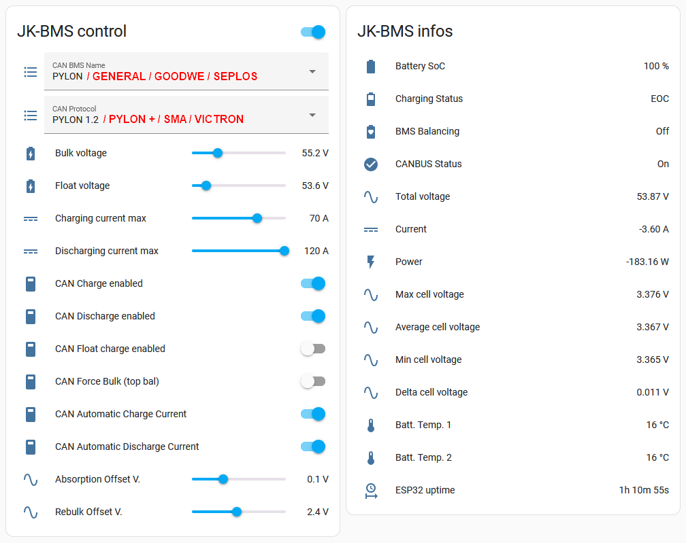

# YamBMS ( Yet another multi-BMS Merging Solution )

**ESPHome component to monitor a Jikong Battery Management System (JK-BMS) and communicate with inverters supporting CANBUS protocol compatible with Pylontech, GoodWe, Seplos, SMA or Victron.**

**Note: Pylontech uses 15s/48v and many others uses 16s/51.2v @3.2v/cell nominal.**
Other battery profiles that utilise the **PYLON** protocol with different cell counts may also work, eg Alpha Ess Smile, BYD Battery-Box LV Flex Lite.
Select the correct battery profile in the inverter to match your battery pack!

The ESP32 communicates with the JK-BMS using the RS485 port (GPS) which is in fact not RS485 but 3.3V UART-TTL, so it can be directly connected to the ESP32.
The ESP32 then sends the required CAN bus data to the inverter via a TJA1050, TJA1051T or SN65HVD230 CAN bus transceiver.

**Note: some inverters only accept a CAN bus at 3.3V in this case please choose the SN65HVD230 chip.**

**Sends over CAN bus to inverter:**
  - Battery Voltage
  - Battery Current (+charge, -discharge)
  - State of Charge (SOC)
  - State of health (SOH)
  - BMS Temperature
  - Charging Voltage
  - Charging Amps
  - Discharge min Voltage
  - Battery name
  - Alarms: Cell over/under voltage, Charge/discharge over current, High/low Temp, BMS fault
  
**Note: This code support multi-BMS connection per inverter (with a single ESP32) and should work with inverters that support the CANBUS protocol PYLON, SMA or Victron.
I'm only testing it with my Deye SUN-6K-SG03-LP1-EU inverter. 
This project is still in development and testing... **

[Dedicated topic on DIY Solar Forum](https://diysolarforum.com/threads/yambms-jk-bms-can-with-new-cut-off-charging-logic-open-source.79325/)

## YamBMS

## Home Assistant

## Contents

1) [Supported devices](documents/README/Supported_devices.md)
2) [Charging Logic](documents/README/Charging_logic.md)
3) [CANBUS protocol](documents/README/CANBUS_protocol.md)
4) [BMS JK-B UART solution](documents/README/BMS_JK-B_UART_solution.md)
5) [BMS JK-PB RS485 solution](documents/README/BMS_JK-PB_RS485_solution.md)
6) [Configuration of the main YAML](documents/README/Main_YAML_config.md)
7) [Installation procedure](documents/README/Installation_procedure.md)

## Requirements

* [ESPHome 2024.6.0 or higher](https://github.com/esphome/esphome/releases)
* ESP32 MCU
* CAN Transceiver (only with TJA1050/TJA1051 : 4.7K resistor for 5V to 3V3 level shifing)
* BMS JK-B*, JK-PB* (other BMS brands already integrated with ESPhome can be added easily)
* Inverters supporting CAN PYLON/Goodwe/SMA/Victron Low Voltage protocol
* Optional: 48V to 5V DC-DC converter to power the ESP32 from the JK-BMS VBAT pin (URB4805YMD-10WR3 or VRB4805S-6WR3)
* Optional: JK RS485 adaptor and RS485 to TTL 3V3 adaptor (see schematic section)

## Changelog

* YamBMS 1.4.2 : Added new `Auto CVL Boost V.` and `Rebulk SoC` functions, new debug.yaml for ESP32 and ESP32-S3, improved code and comments
* CANBUS 2.3.1 : Improved the procedure for sending canbus frames with reduced loop time, rewritten of the canbus link validation code and added `Inverter Heartbeat Monitoring` function
* YamBMS 1.4.1 : Rewriting of the alarm system, bug fixes and improvement of the charging logic (new status `Cut-Off`), icon allocation for each sensor, UART and CANBUS `!extend ${vars}`, New sensor `YamBMS Delta Cell V.`, Improved `Battery SOC` logic
* YamBMS 1.3.2 : New var `yambms_cell_count`, the BMS charge or discharge switches can be activated separately without causing the decombination of the BMS, new `minimal` version of the BMS YAML in order to reduce the loop time
* YamBMS 1.3.1 : First multi-BMS version named `YamBMS`

## Goodies

A user of the [@syssi](https://github.com/syssi) [esphome-jk-bms](https://github.com/syssi/esphome-jk-bms) project ([@dr3amr](https://github.com/dr3amr)) shared some [Home Assistant Lovelace UI cards for a beautiful dashboard here](https://github.com/syssi/esphome-jk-bms/discussions/230).

## References

* Thanks to [@syssi](https://github.com/syssi/esphome-jk-bms) for help and making the original JK-B UART and BLE code.
* Thanks to [@txubelaxu](https://github.com/txubelaxu/esphome-jk-bms) for help and making the original JK-PB RS485 code.
* Thanks to [@uksa007](https://www.patreon.com/Uksa007Codedevelopment) for making the original CANBUS code.
