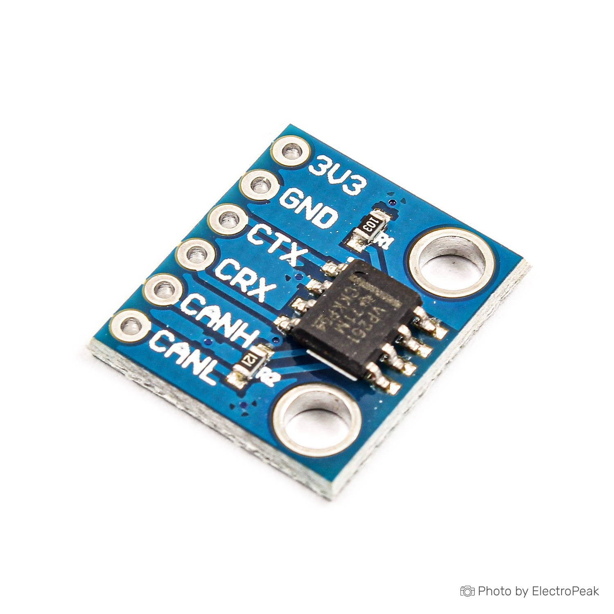

# YamBMS ( Yet another multi-BMS Merging Solution )

[](https://www.gnu.org/licenses/gpl-3.0)
[](https://github.com/Sleeper85/esphome-jk-bms-can/releases/latest)


**ESPHome component to monitor a Jikong Battery Management System (JK-BMS) and communicate with inverters supporting CAN bus protocol compatible with Pylontech, GoodWe, Seplos, SMA or Victron.**

**Note: Pylontech uses 15s/48v and many others uses 16s/51.2v @3.2v/cell nominal.**
Other battery profiles that utilise the **PYLON** protocol with different cell counts may also work, eg Alpha Ess Smile, BYD Battery-Box LV Flex Lite.
Select the correct battery profile in the inverter to match your battery pack!

The ESP32 communicates with the JK-BMS using the RS485 port (GPS) which is in fact not RS485 but 3.3V UART-TTL, so it can be directly connected to the ESP32.
The ESP32 then sends the required CAN bus data to the inverter via a TJA1050, TJA1051T or SN65HVD230 CAN bus transceiver.

**Note: some inverters only accept a CAN bus at 3.3V in this case please choose the SN65HVD230 chip.**

**Sends over CAN bus to inverter:**
  - Battery Voltage
  - Battery Current (+charge, -discharge)
  - State of Charge (SOC)
  - State of health (SOH)
  - BMS Temperature
  - Charging Voltage
  - Charging Amps
  - Discharge min Voltage
  - Battery name
  - Alarms: Cell over/under voltage, Charge/discharge over current, High/low Temp, BMS fault
  
**Note: This code support multi-BMS connection per inverter (with a single ESP32) and should work with inverters that support the CAN bus protocol shown in the table below.
I'm only testing it with my Deye SUN-6K-SG03-LP1-EU inverter.<br>
This project is still in development and testing...<br>**

[Dedicated topic on DIY Solar Forum](https://diysolarforum.com/threads/yambms-jk-bms-can-with-new-cut-off-charging-logic-open-source.79325/)

## YamBMS


## Charging Logic Diagram

The charging voltage and current correspond to the default values in the YAML script and can be modified.

[Cut-Off Charging Logic](documents/README/Cut-Off_Charging_Logic.md) (what's happening in the yellow diamond)


## CAN Protocol Table


Note: the following IDs are not implemented: 0x35B, 0x360, 0x378, 0x380 and 0x381.

## Home Assistant and API


If your ESP32 is not connected with Home Assistant it will reboot every 15 minutes.
This is the normal behavior of ESPHome if HA is not connected to the ESP32 API.
This is not a bug to be resolved but a mechanism put in place by the ESPHome team to correct a possible problem with the API connection.

The **"api:"** section is therefore configured by default not to reboot every 15 minutes if Home Assistant is not connected.

```YAML
# +------------------------------------------------------------------+
# | ** The settings below can be modified according to your needs ** |
# +------------------------------------------------------------------+

api:
  reboot_timeout: 0s
```

## Web Server

**Please note that enabling this component will take up a lot of memory and may decrease stability and be the cause of reboot depending on the capabilities of the board used.**

If you don't use Home Assistant, you can activate the web server and have access to information coming from JK-BMS and also interact with the application.


The web server is not enabled by default.<br>
To enable this feature, uncomment the lines below in your YAML file.

```ỲAML
# +------------------------------------------------------------------+
# | ** The settings below can be modified according to your needs ** |
# +------------------------------------------------------------------+

web_server:
  port: 80
  log: false
  ota: false
```

## WiFi

By default, if the ESP32 is disconnected from the WiFi network it will reboot every 15 minutes to try to resolve the problem.<br>
If you don't want to connect the ESP32 to the WiFi network please remove the lines below in your YAML file.

```YAML
# +------------------------------------------------------------------+
# | ** The settings below can be modified according to your needs ** |
# +------------------------------------------------------------------+

wifi:
  ssid: !secret wifi_ssid
  password: !secret wifi_password
  domain: !secret domain
```

## Changelog

* 1.4.1  Sleeper85 : Rewriting of the alarm system, bug fixes and improvement of the charging logic (new status "Cut-Off"), icon allocation for each sensor
* 1.3.2  Sleeper85 : New var `yambms_cell_count`, the BMS charge or discharge switches can be activated separately without causing the decombination of the BMS, new `minimal` version of the BMS YAML in order to reduce the loop time
* 1.3.1  Sleeper85 : First multi-BMS version named `YamBMS`

## Supported inverter

Inverters supporting CAN PYLON/Goodwe/SMA/Victron Low Voltage protocol should work, check your inverter manual to confirm.

The following are confirmed and known to work:

| Brand | Model | Satus | Reported by | Inverter battery | BMS | BMS link | ESP32 board | CAN name | CAN protocol | CAN board | Multi-BMS | Remarks |
| --- | --- | --- | --- | --- | --- | --- | --- | --- | --- | --- | --- | --- |
| Deye | SUN-6K-SG03LP1-EU | Working | [@Sleeper85](https://github.com/Sleeper85) | Lithium 00 | JK-B* | UART | ESP32 DevKit V1 | PYLON | PYLON 1.2 | TJA1051T | no | --- |
| Deye | SUN-5K-SG03LP1-EU | Working | [@vdiex](https://github.com/vdiex) | Lithium 00 | JK-B* | UART | ESP32 DevKit V1 | PYLON | PYLON 1.2 | --- | no | --- |
| Deye | SUN-12K-SG04LP3-EU | Working | [@lucize](https://github.com/lucize) | Lithium 00 | JK-B* | UART | ESP32 DevKit V1 | PYLON | PYLON 1.2 | --- | no | --- |
| Deye | SUN-3.6K-SG03LP1-EU | Working | [@Der_Hannes](https://diysolarforum.com/members/der_hannes.16949/) | Lithium 00 | JK-B* | UART | ESP32 DevKit V1 | PYLON | PYLON 1.2 | SN65HVD230 **3.3V** | no | --- |
| Deye | SUN-5K-SG03LP1-EU | Working | [@arzaman](https://github.com/arzaman) | Lithium 00 | JK-B* | BLE | Atom S3 | PYLON | PYLON 1.2 | [Atomic CAN base (CA-IS3050G)](https://docs.m5stack.com/en/atom/Atomic%20CAN%20Base) | no | --- |
| Deye | SUN-5K-SG03LP1-EU (3) | Working | [@widget4145](https://diysolarforum.com/members/widget4145.110784/) | Lithium 00 | JK-PB* (7) | RS485 | Atom S3 Lite | PYLON | PYLON 1.2 | [Atomic CAN base (CA-IS3050G)](https://docs.m5stack.com/en/atom/Atomic%20CAN%20Base) | yes | --- |
| Goodwe | 3648-ES (GW5048-ES) | Working | [@jirdol](https://github.com/jirdol) | --- | JK-B* | UART | ESP32 DevKit V1 | GOODWE | PYLON + | --- | no | --- |
| Goodwe | GW5000S-BP | Working | [@Uksa007](https://github.com/Uksa007) | Goodwe LX U5.4-L | JK-B* | UART | ESP32 DevKit V1 | GOODWE | PYLON + | --- | no | --- |
| Goodwe | GW5000S-BP & GW3600S-BP | Working | [@OselDusan7](https://github.com/OselDusan7) | --- | JK-B* | UART | ESP32 DevKit V1 | GOODWE | PYLON + | --- | no | --- |
| Sofar | ME 3000-SP | Working | [@starman](https://diysolarforum.com/members/starman.65151/) | --- | JK-B* | UART | ESP32 DevKit V1 | --- | --- | --- | no | --- |
| Sofar | HYD 5000-ES | Working | [@Paulfrench35](https://diysolarforum.com/members/paulfrench35.78523/) | --- | JK-B* | UART | ESP32 DevKit V1 | --- | --- | --- | no | --- |
| Sofar | HYD 5000-EP | Working | [@tonystrullu](https://diysolarforum.com/members/tonystrullu.91283/) | --- | JK-B* | UART | ESP32 DevKit V1 | --- | --- | --- | no | --- |
| Sofar | HYD 3600-ES | Working | [@chaosnature](https://diysolarforum.com/members/chaosnature.64395/) | Automatic | JK-PB* (2) | BLE | Atom S3 (display) | PYLON | PYLON 1.2 | [Atomic CAN base (CA-IS3050G)](https://docs.m5stack.com/en/atom/Atomic%20CAN%20Base) | yes | DIY Li-ion Growatt GBLI5001 converted. A 120 Ohm resistor had to be added on the Sofar side. Prefared over original BMS Manufacture's Management System. |
| Growatt | SPF 5000ES | Working | [@Paulfrench35](https://diysolarforum.com/members/paulfrench35.78523/) | CAN L52 | JK-B* | UART | ESP32 DevKit V1 | PYLON | PYLON 1.2 | --- | no | --- |
| Growatt | SPF 5000ES | Working | [@cjdell](https://github.com/cjdell) | CAN L52 | JK-B* | UART | ESP32 DevKit V1 | PYLON | PYLON 1.2 | --- | no | --- |
| Growatt | SPF 5000ES | Working | [@cinusik](https://diysolarforum.com/members/cinusik.109738/) | CAN L52 | JK-PB* (2) | BLE | Atom S3 (display) | PYLON | PYLON 1.2 | [CANBus Unit (CA-IS3050G)](https://docs.m5stack.com/en/unit/can) | yes | Best solution for the incomplete/wrong protocols implementation on JK Inverter BMSes and some inverters. |
| Solis | RHI-3.6K-48ES-5G | Working | [@cjdell](https://github.com/cjdell) | Pylon LV | JK-B* | UART | ESP32 DevKit V1 | PYLON | PYLON + | SN65HVD230 **3.3V** | no | --- |
| Solis | S5-EH1P4.6K-L | Working | [@Baker0052](https://github.com/Baker0052) | Pylon LV | JK-B* | UART | ESP32 DevKit V1 | PYLON | PYLON + | SN65HVD230 **3.3V** | no | --- |
| Solis | S5-EH1P6K-L | Working | [@MrPabloUK](https://github.com/MrPabloUK) | AoBo | JK-B* | UART | ESP32 DevKit V1 | SMA | SMA | [Adafruit CAN Pal](https://learn.adafruit.com/adafruit-can-pal/overview) | no | --- |
| Solis | RHI-3.6K-48ES-5G | Working | [@MrPabloUK](https://github.com/MrPabloUK) | AoBo | JK-B* | UART | ESP32 DevKit V1 | SMA | SMA | [Adafruit CAN Pal](https://learn.adafruit.com/adafruit-can-pal/overview) | no | --- |
| Solis | RHI-3K-48ES | Working | [@chaosnature](https://diysolarforum.com/members/chaosnature.64395/) | AoBo | JK-B* (2) | BLE | Atom S3 Lite | SMA | SMA | [Atomic CAN base (CA-IS3050G)](https://docs.m5stack.com/en/atom/Atomic%20CAN%20Base) | yes | DIY Li-ion Growatt GBLI5001 converted. |
| LuxPower | LXP SNA 5K | Working | [@shvmm](https://github.com/shvmm) | Li 02 | JK-B* | UART | ESP32 DevKit V1 | PYLON | PYLON + | SN65HVD230 **3.3V** | no | --- |
| --- | Turbo Energy | Working | [@ibikku](https://github.com/ibikku) | --- | JK-B* | UART | ESP32 DevKit V1 | --- | --- | --- | no | --- |
| SMA | Sunny Island  | --- | --- | --- | --- | --- | --- | --- | --- | --- | --- | --- |
| Victron | --- | --- | --- | --- | --- | --- | --- | --- | --- | --- | --- | --- |

## Supported BMS

All JK-B* and JK-PB* models with software@ version `>=6.0` are using the implemented protocol and should be supported.

See the [@syssi](https://github.com/syssi) [esphome-jk-bms](https://github.com/syssi/esphome-jk-bms) repository for more information.

## Supported CAN Transceiver

| TJA1050 | TJA1051 | SN65HVD230 |
| --- | --- | --- |
|  |  |  |

| Atomic CAN Base | MCP2515 |
| --- | --- |
|  |  |

## Requirements

* [ESPHome 2024.6.0 or higher](https://github.com/esphome/esphome/releases).
* Generic ESP32 DevKit v1 30 pin board or M5Stack Atom Lite (ESP32-PICO)
* NOTE: ESP32-S2 currently has issues with CAN BUS and does not work!
* For 5V CAN bus : TJA1050 or TJA1051T CAN controller interface module and 4.7K resistor for 5v to 3.3v level shifing.
* For 3.3V CAN bus : SN65HVD230 CAN controller interface module without 4.7K resistor
* For Atom CAN bus : M5Stack ATOMIC CAN Base (CA-IS3050G)
* Optional: 48V to 5V DC-DC converter to power the ESP32 from the JK-BMS VBAT pin (URB4805YMD-10WR3 or VRB4805S-6WR3)
* Optional: JK RS485 Adaptor and RS484 to TTL3.3v Adaptor (see optional schematic below)

## Buy the M5Stack Atom CAN Kit (the Plug & Play solution)

If soldering or creating your own board seems complicated to you, know that it is possible to use the Atom CAN Kit from M5Stack.<br>

**Recommended: Atom S3 Lite + Atomic CAN Base**

- [Atom S3 - SKU:C123](https://docs.m5stack.com/en/core/AtomS3)
- [Atom S3 Lite - SKU:C124](https://docs.m5stack.com/en/core/AtomS3%20Lite)
- [Atomic CAN Base - SKU:A103](https://docs.m5stack.com/en/atom/Atomic%20CAN%20Base)


## Build your own board

This is an example of an ESP32 DevKit v1 30 pin board powered by the BMS.


## Schematic and setup instructions

If you don't want to connect a wire between the BMS and the ESP32 choose the **Bluetooth** version => **esp32_ble_jk-bms-can.yaml**<br>
If you prefer to use a wired connection between the BMS and the ESP32 choose the **Wire** version => **esp32_wire_jk-bms-can.yaml**


**Atom S3 Lite (ESP32-S3)**

Note: Follow the configuration instructions in the **config_atom-s3-lite-esp32-s3.yaml** file (config folder).

```

              UART-TTL               RS232-TTL                   CAN BUS
┌──────────┐            ┌──────────┐             ┌────────────┐              ┌──────────┐
│          │<TX------RX>│2        5│<TX-------TX>|            |              |          |
│  JK-BMS  │<RX------TX>│1        6│<RX-------RX>| CA-IS3050G |<---CAN H --->| Inverter |
│          │<----GND--->│   ESP32  │             |    CAN     |<---CAN L --->|          |
│          │     5V---->│5V     3V3|             |            |              |          |
└──────────┘            └──────────┘             └────────────┘              └──────────┘

```

**Atom Lite (ESP32-PICO)**

Note: Follow the configuration instructions in the **config_atom-lite-esp32-pico.yaml** file (config folder).

```

              UART-TTL               RS232-TTL                   CAN BUS
┌──────────┐            ┌──────────┐             ┌────────────┐              ┌──────────┐
│          │<TX------RX>│26      22│<TX-------TX>|            |              |          |
│  JK-BMS  │<RX------TX>│32      19│<RX-------RX>| CA-IS3050G |<---CAN H --->| Inverter |
│          │<----GND--->│   ESP32  │             |    CAN     |<---CAN L --->|          |
│          │     5V---->│5V     3V3|             |            |              |          |
└──────────┘            └──────────┘             └────────────┘              └──────────┘

```

**Generic ESP32 DevKit v1 30 pin**

Note: Follow the configuration instructions in the **config_generic-esp32-devkit-v1.yaml** file (config folder).

```
3.3V CAN BUS

              UART-TTL               RS232-TTL                 CAN BUS (3V3)
┌──────────┐            ┌──────────┐             ┌────────────┐              ┌──────────┐
│          │<TX------RX>│16      23│<TX-------TX>|            |              |          |
│  JK-BMS  │<RX------TX>│17      22│<RX-------RX>| SN65HVD230 |<---CAN H --->| Inverter |
│          │<----GND--->│   ESP32  │<----GND---->|    CAN     |<---CAN L --->|          |
│          │     5V---->│VIN    3V3│<---3.3V---->|            |              |          |
└──────────┘            └──────────┘             └────────────┘              └──────────┘


5V CAN BUS

              UART-TTL               RS232-TTL                 CAN BUS (5V)
┌──────────┐            ┌──────────┐             ┌────────────┐              ┌──────────┐
│          │<TX------RX>│16      23│<TX-------TX>|            |              |          |
│  JK-BMS  │<RX------TX>│17      22│<RX--4K7--RX>|  TJA1050   |<---CAN H --->| Inverter |
│          │<----GND--->│   ESP32  │<----GND---->|    CAN     |<---CAN L --->|          |
│          │     5V---->│VIN    VIN│<----5V----->|            |              |          |
└──────────┘            └──────────┘             └────────────┘              └──────────┘

```

**Schématic with addition of the UART-TTL to RS485 adapter sold by JK-BMS**

```

              UART-TTL                  RS485              RS485-TTL              RS232-TTL                CAN BUS
┌──────────┐            ┌───────────┐           ┌────────┐           ┌─────────┐             ┌─────────┐              ┌──────────┐
│          │<----TX---->│Y    JK   Y│<A------A+>│        │<TX-----RX>│16     23│<TX-------TX>|         |              |          |
│  JK-BMS  │<----RX---->│W  RS485  W│<B------B->│ RS485  │<RX-----TX>│17     22│<RX--4K7--RX>| TJA1050 |<---CAN H --->| Inverter |
│          │<----GND--->│B Adaptor B│<---GND--->│To 3.3V │<---GND--->|         |<----GND---->|   CAN   |<---CAN L --->|          |
│          │<----VBAT-->│R          │           │        │<---3.3V-->|  ESP32  |<----5V----->|         |              |          |
└──────────┘            └───────────┘           └────────┘           └─────────┘             └─────────┘              └──────────┘

```

**JK-BMS UART-TTL GPS port**

```
# UART-TTL GPS port on JK-BMS (4 pin, JST 1.25mm pitch)
┌─── ─────── ────┐
│                │
│ O   O   O   O  │
│GND  RX  TX VBAT│ 
└────────────────┘
  │   │   │   | VBAT is full battery volatge eg 51.2V (No connect)
  │   │   └──── ESP32 (`rx_pin`)
  │   └──────── ESP32 (`tx_pin`)
  └──────────── GND
```


The UART-TTL (labeled as `RS485`) socket of the BMS can be attached to any UART pins of the ESP.<br>
A hardware UART should be preferred because of the high baudrate (115200 baud).<br>
The connector is called 4 pin JST with 1.25mm pitch.

## Installation

This YAML file is based on the [@syssi](https://github.com/syssi) [esphome-jk-bms](https://github.com/syssi/esphome-jk-bms) repository.

```yaml
external_components:
  - source: github://syssi/esphome-jk-bms@main
```

**Installation procedure:**

1. **Install ESPHome on your computer**<br>
Before you can flash the YAML file you need to install the esphome application (command line).<br>
[Follow these instructions for installation on Windows, Mac or Linux.](https://esphome.io/guides/installing_esphome)

2. **Download YAML files to your computer**<br>
You can do this from the command line or in your preferred method.

```bash
# Clone this external component
git clone https://github.com/Sleeper85/esphome-yambms.git
cd esphome-yambms
```

3. **Enter your WiFi credentials in the secrets.yaml files**

```yaml
wifi_ssid: YourSSID
wifi_password: YourPassword
domain : .local
```

4. **Install the application in the ESP32**<br>
Choose the main YAML that best suits your needs like for example "multi-bms_ble_one-esp.yaml".<br>
Validate the configuration, create a binary, upload it, and start logs.<br>
**The only YAML that needs to be checked and configured is the main one like for example "multi-bms_ble_one-esp.yaml" but you can modify other YAMLs if you want.<br>
The goal is that the main YAML which contains all your specific parameters can be preserved and reused each time the other YAMLs classified in the 'packaged' folder are updated.**

```bash
# To install the multi-bms Wire version
esphome run multi-bms_wire_one-esp.yaml

# To install the multi-bms Bluetooth version
esphome run multi-bms_ble_one-esp.yaml

# upgrade via OTA by specifying the IP address of the ESP32
esphome run multi-bms_wire_one-esp.yaml --device 192.168.x.x
```

5. **Optional: add the ESP32 in Home Assistant**<br>
In Home Assistant under **" Settings > Devices and services > Add Intergration "** select ESPHome add device jk-bms-can if found or supply ip address of ESP32.

## ESPHome bash command

```bash
# test the config
esphome config multi-bms_wire_one-esp.yaml

# install the config in ESP32
esphome run multi-bms_wire_one-esp.yaml

# check the logs (the --device option is not required)
esphome logs multi-bms_wire_one-esp.yaml --device 192.168.x.x
```

## Known issues

* The battery type sensor is pretty useless because the BMS reports always the same value (`Ternary Lithium`). Regardless of which battery type was set / parameter set was loaded via the android app. ([#9][i9])
* ESP32: Adding all supported sensors can lead to a stack overflow / boot loop. This can be solved by increasing the stack size. ([#63][i63])

[i9]: https://github.com/syssi/esphome-jk-bms/issues/9
[i63]: https://github.com/syssi/esphome-jk-bms/issues/63

## Goodies

A user of the [@syssi](https://github.com/syssi) [esphome-jk-bms](https://github.com/syssi/esphome-jk-bms) project ([@dr3amr](https://github.com/dr3amr)) shared some [Home Assistant Lovelace UI cards for a beautiful dashboard here](https://github.com/syssi/esphome-jk-bms/discussions/230).


## Debugging

If this component doesn't work out of the box for your device please update your configuration to enable the debug output of the UART component and increase the log level to the see outgoing and incoming serial traffic:

```
logger:
  level: DEBUG

uart:
  id: uart_0
  baud_rate: 115200
  rx_buffer_size: 384
  tx_pin: ${tx_pin}
  rx_pin: ${rx_pin}
  debug:
    direction: BOTH
```

## References

* https://www.patreon.com/Uksa007Codedevelopment Thanks to @uksa007 for making the original CAN code.
* https://github.com/syssi/esphome-jk-bms Thanks go to @syssi for help and making the original RS485 code.

