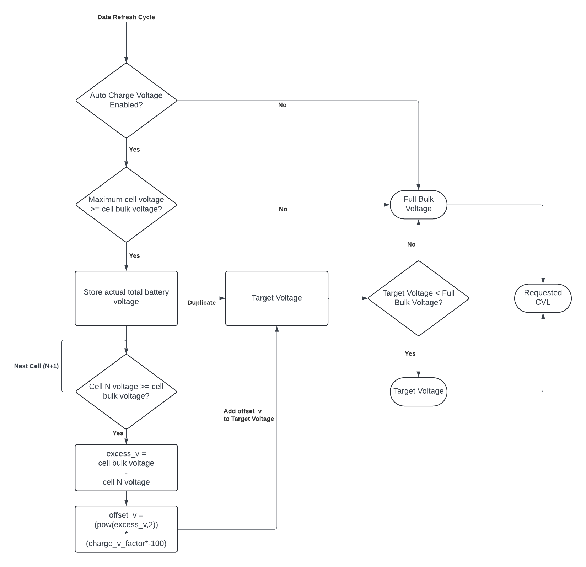

# JK-BMS-CAN

## Automatic Charge Voltage

Special thanks to [@MrPabloUK](https://github.com/MrPabloUK) for creating the logic.

When enabled, the Automatic Charge Voltage feature will dynamically adjust the request CVL (Charge Voltage Limit) as sent by the ESP32 device.  
This feature is designed to automatically reduce the liklihood of a cell reaching overvoltage thresholds, as well as reducing charge current enough for balancing to be more effective.

There are several inputs used in this logic:
- Cell bulk voltage - automatically calculated as bulk voltage / cell count.
- Charge V factor - multiplier that alters the aggression of the logic. The higher the value, the more severe the cell penalty.
- Cell voltage - as reported by the BMS

This logic will first check if enabled, then if any cells are at or over cell bulk voltage.  
If either of these are not true, then standard full bulk voltage will be sent to the inverter as the requested CVL.

If not, then each cell that is at or over cell bulk voltage will have an automatically calculated penalty voltage applied.  
This penalty will increase in severity as the cell voltage increases above bulk voltage.  
Penalties are then applied against the current battery voltage, resulting in a target voltage equal or lower than the current battery voltage.  
This target voltage is then sent to the inverter as the requested CVL.

A reference spreadsheet has been created that shows how the CVL changes based on cell voltages:
https://docs.google.com/spreadsheets/d/1UwZ94Qca-DBP5gppzKmAjbMJYZGjR4lMwZtwwQR9wWY/edit?usp=sharing

