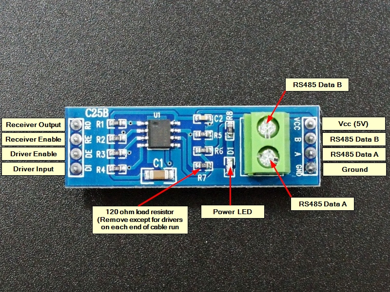
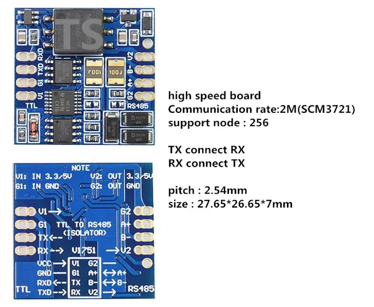
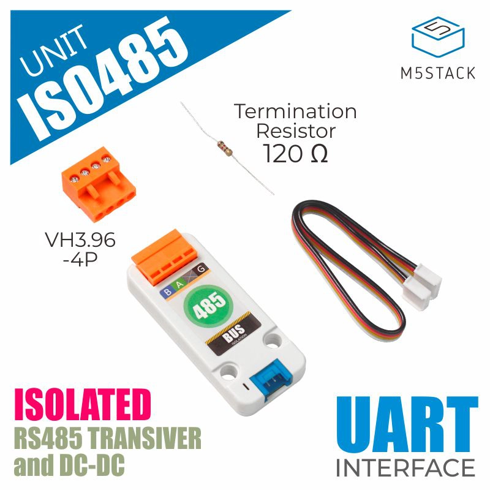
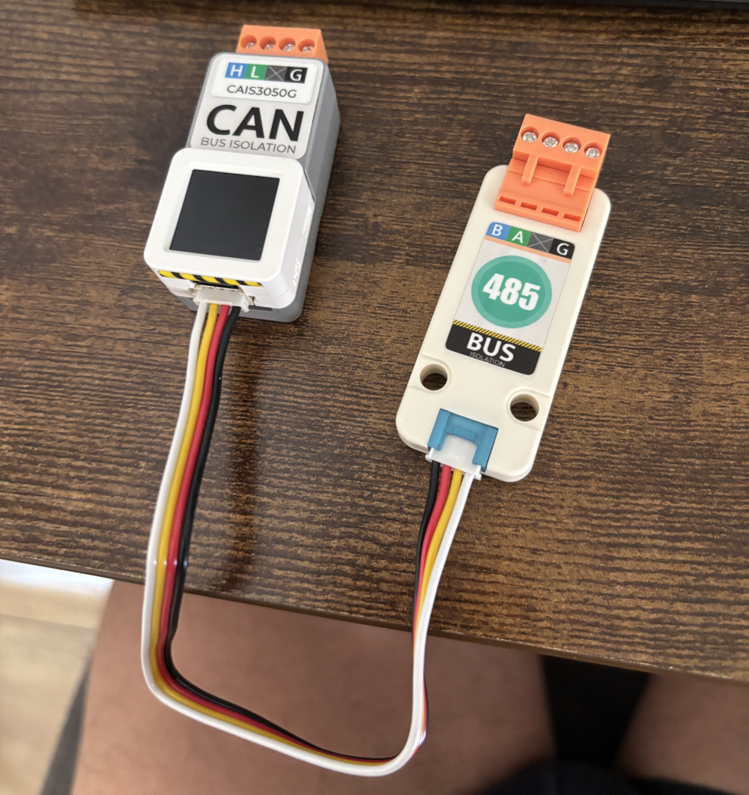
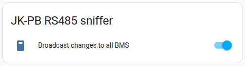

# YamBMS - JK-PB BMS RS485 Solution

[](https://www.gnu.org/licenses/gpl-3.0)
[](https://github.com/Sleeper85/esphome-jk-bms-can/releases/latest)


## External component

[JK_RS485](https://github.com/txubelaxu/esphome-jk-bms/blob/main/components/jk_rs485_bms/README.md) by [@txubelaxu](https://github.com/txubelaxu)

## ESP32 board

Hardware wise, [Atom S3](https://docs.m5stack.com/en/core/AtomS3) solution is easier and cleaner but [ESP32-S3 DevKitC-1](https://docs.espressif.com/projects/esp-idf/en/v5.3/esp32s3/hw-reference/esp32s3/user-guide-devkitc-1.html) has more GPIOs and PSRAM.

### Atom S3

- [Atom S3 - SKU:C123](https://docs.m5stack.com/en/core/AtomS3)
- [Atom S3 Lite - SKU:C124](https://docs.m5stack.com/en/core/AtomS3%20Lite)
- [Atomic CAN Base - SKU:A103](https://docs.m5stack.com/en/atom/Atomic%20CAN%20Base)

Note: `Atom S3 Lite` does not have a display.

### ESP32-S3 DevKitC-1

- [ESP32-S3 N16R8](https://a.aliexpress.com/_EzFdrw3)
- [SN65HVD230 3V3 CAN transceiver](https://a.aliexpress.com/_Evq9Ra7)

## RS485 unisolated board (not recommanded)

This board is the one used by [@txubelaxu](https://github.com/txubelaxu) the developer of the RS485 component for the new JK-PB series BMS.<br>
This board is certainly not the best, it does not have galvanic isolation and requires a `TALK PIN`.



## RS485 isolated board (recommended for making your own PCB)

This board has galvanic isolation and does not require a `TALK PIN` (this avoids having to solder a wire to the Atomic CAN base of the Atom S3).



[RS485 isolated board (high speed dual)](https://a.aliexpress.com/_EueIZT5)

Note: choose the `high speed dual` version !

## M5stack RS485 isolated unit [SKU:U094] (recommended with M5stack Atom S3 solution)

If you are using M5stack solution with Atom S3, this [RS485 unit](https://docs.m5stack.com/en/unit/iso485) is the simplest solution without soldering.

")

## M5stack Atom S3 with CAN base and RS485 unit

If soldering or creating your own board seems complicated to you, know that it is possible to use the Atom S3 solution from M5Stack.

**Choose Atom S3 (display) or Atom S3 Lite + Atomic CAN base + RS485 unit**

- [Atom S3 - SKU:C123](https://docs.m5stack.com/en/core/AtomS3)
- [Atom S3 Lite - SKU:C124](https://docs.m5stack.com/en/core/AtomS3%20Lite)
- [Atomic CAN Base - SKU:A103](https://docs.m5stack.com/en/atom/Atomic%20CAN%20Base)
- [RS485 Isolated Unit - SKU:U094](https://docs.m5stack.com/en/unit/iso485)

| Atomic S3 Lite | Atomic CAN Base | RS485 isolated Unit |
| --- | --- | --- |
|  |  |   |

The example below uses an Atom S3 (display) with the CAN base and RS485 unit.



## Schematic and setup instructions

Note: the choice of RS485 board is not related to the chosen ESP32.

### Atom S3 with unisolated RS485 board

```
┌──────────┐                 ┌───────────┐                       ┌──────────┐
│          │                 │   UART    │<-VCC--------------5V--│          │<---5V
│   BMS    │                 │    TO     │                       │   ESP32  │
│  JK-PB   │<-RJ45-P1 ----A->│   RS485   │<-DI-----------TX--G1--│  ATOM S3 │
│          │<-RJ45-P2-----B->│           │--RO-----------RX--G2->│          │                  ┌────────────┐             ┌────────────┐
│  RS485   │                 │ CONVERTER │<-DE--+                │          │--G5--TX-----CTX->|            |             |            |
│ NETWORK  │                 │           │<-RE--└--TALK PIN--G8--│          │<-G6--RX-----CRX--|   Atomic   |<---CAN H--->|  Inverter  |
│          │                 │           │                       │          │<-------5V------->|  CAN Base  |<---CAN L--->|            |
|          |<-RJ45-P3---GND->|           |<-GND-------------GND->|          |<-------GND------>|            |             |            |
└──────────┘                 └───────────┘                       └──────────┘                  └────────────┘             └────────────┘
```

### ESP32-S3 with isolated RS485 board

```
┌──────────┐                 ┌───────────┐                       ┌──────────┐
│          │                 │   UART    │<-V1--------3V3 or 5V--│          │<---5V
│   BMS    │                 │    TO     │                       │          │
│  JK-PB   │<-RJ45-P2-----B->│   RS485   │<-RX-----------TX--17--│ ESP32-S3 │
│          │<-RJ45-P1 ----A->│           │--TX-----------RX--18->│          │                  ┌────────────┐             ┌────────────┐
│  RS485   │                 │ CONVERTER │                       │          │--38--TX-----CTX->|            |             |            |
│ NETWORK  │                 │           │      No TALK PIN (8)--│          │<-39--RX-----CRX--|    CAN     |<---CAN H--->|  Inverter  |
│          │                 │           │                       │          │<-------3V3------>| SN65HVD230 |<---CAN L--->|            |
|          |<-RJ45-P3----G2->|           |<-G1--------------GND->|          |<-------GND------>|            |             |            |
└──────────┘                 └───────────┘                       └──────────┘                  └────────────┘             └────────────┘
```

- [RJ45 568A pinout](../../images/RJ45-Pinout-T568A.jpg)
- [RJ45 568B pinout](../../images/RJ45-Pinout-T568B.jpg)

## BMS DIP switch config (mode 2)

With mode 2, the sniffer (ESP32) will automatically take the address 0x00 and act as master BMS (max 15 BMS).

- BMS 1 RS485 address : 0x01
- BMS 2 RS485 address : 0x02
- BMS 3 RS485 address : 0x03
- etc.

## JK-PB RS485 functions

### Sniffer Broadcast changes to all BMS



When enabled, this function synchronizes the settings of all your BMS connected to the same RS485 network as soon as you make parameter changes.
