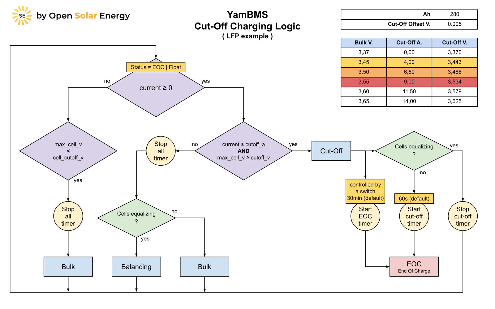

# YamBMS - Charging Logic

## Charging Logic Diagram

The charging voltage and current correspond to the default values in the YAML script and can be modified.

## Cut-Off Charging Logic Equation

Source: [Charging Marine Lithium Battery Banks](https://nordkyndesign.com/charging-marine-lithium-battery-banks)

Special thanks to [@shvmm](https://github.com/shvmm) for creating the equations.

Note: The equations below are valid for other chemistries like Li-ion and LTO but with other CVmin and CVmax values.

## Cut-Off Charging Logic Diagram (what's happening in the yellow diamond)

Note: The diagram below is valid for other chemistries like Li-ion and LTO but with other CVmin and CVmax values.

## LFP Cut-Off Values

- Nominal : 3.20 V
- CV min : 3.37 V
- CV max : 3.65 V

## Li-ion Cut-Off Values

- Nominal : 3.60 V
- CV min : 3.90 V
- CV max : 4.20 V

## LTO Cut-Off Values

- Nominal : 2.40 V
- CV min : 2.55 V
- CV max : 2.85 V

