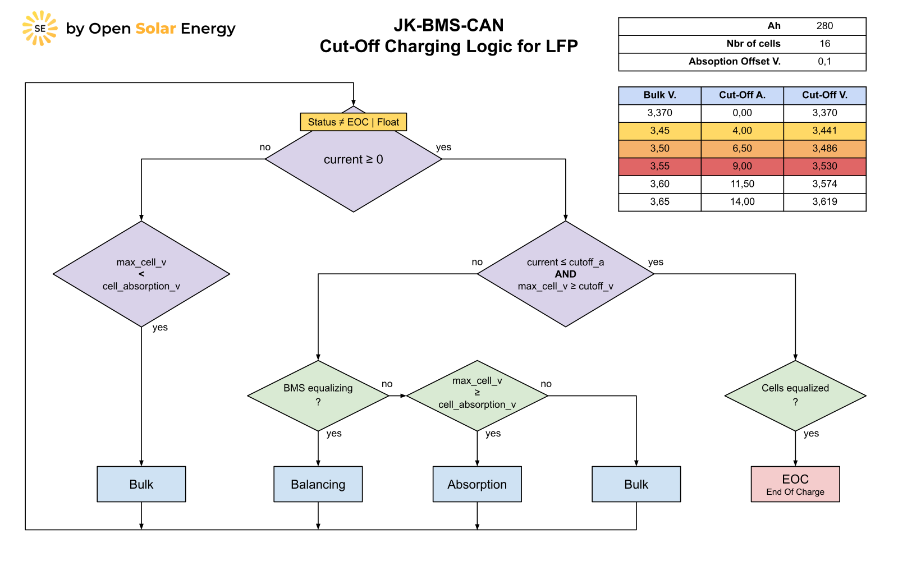
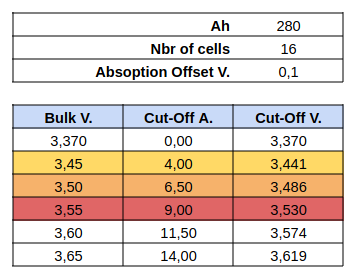
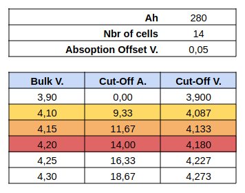

# JK-BMS-CAN

## Cut-Off Charging Logic Equation

Source: [Charging Marine Lithium Battery Banks](https://nordkyndesign.com/charging-marine-lithium-battery-banks)

Special thanks to [@shvmm](https://github.com/shvmm) for creating the equations.

Note: The equations below are valid for other chemistries like Li-ion and LTO but with other CVmin and CVmax values.

## Cut-Off Charging Logic Diagram

Note: The diagram below is valid for other chemistries like Li-ion and LTO but with other CVmin and CVmax values.

## LFP Cut-Off Values

## Li-ion Cut-Off Values

## LTO Cut-Off Values

Will be added in the future.
