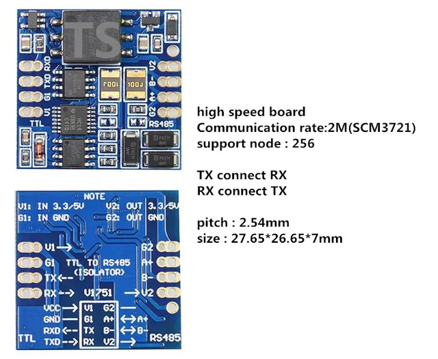

# JK-BMS-PB-CAN

## External component

[JK_RS485](https://github.com/txubelaxu/esphome-jk-bms/blob/main/components/jk_rs485_bms/README.md) by [@txubelaxu](https://github.com/txubelaxu)

## ESP32 board

Hardware wise, [Atom S3](https://docs.m5stack.com/en/core/AtomS3) solution is easier and cleaner but [ESP32-S3 DevKitC-1](https://docs.espressif.com/projects/esp-idf/en/v5.3/esp32s3/hw-reference/esp32s3/user-guide-devkitc-1.html) has more GPIOs and PSRAM.

### Atom S3

- [Atom S3 - SKU:C123](https://docs.m5stack.com/en/core/AtomS3)
- [Atom S3 Lite - SKU:C124](https://docs.m5stack.com/en/core/AtomS3%20Lite)
- [Atomic CAN Base - SKU:A103](https://docs.m5stack.com/en/atom/Atomic%20CAN%20Base)

Note: `Atom S3 Lite` does not have a display.

### ESP32-S3 DevKitC-1

- [ESP32-S3 N16R8](https://a.aliexpress.com/_EzFdrw3)
- [SN65HVD230 3V3 CAN Transceiver](https://a.aliexpress.com/_Evq9Ra7)

## RS485 unisolated board

This board is the one used by [@txubelaxu](https://github.com/txubelaxu) the developer of the RS485 component for the new JK-PB series BMS.<br>
This board is certainly not the best, it does not have galvanic isolation and requires a `TALK PIN`.


### RS485 isolated board (recommended)

This board has galvanic isolation and does not require a `TALK PIN` (this avoids having to solder a wire to the Atomic CAN base of the Atom S3).



[RS485 isolated board (high speed dual)](https://a.aliexpress.com/_EueIZT5)

Note: choose the `high speed dual` version !

## Schematic and setup instructions

Note: the choice of RS485 board is not related to the chosen ESP32.

### Atom S3 with unisolated RS485 board

```
┌──────────┐                 ┌───────────┐                       ┌──────────┐
│          │                 │   UART    │<-VCC--------------5V--│          │<---5V
│   BMS    │                 │    TO     │                       │   ESP32  │
│  JK-PB   │<-RJ45-P1 ----A->│   RS485   │<-DI-----------TX--G1--│  ATOM S3 │
│          │<-RJ45-P2-----B->│           │--RO-----------RX--G2->│          │                  ┌────────────┐             ┌────────────┐
│  RS485   │                 │ CONVERTER │<-DE--+                │          │--G5--TX-----CTX->|            |             |            |
│ NETWORK  │                 │           │<-RE--└--TALK PIN--G8--│          │<-G6--RX-----CRX--|   Atomic   |<---CAN H--->|  Inverter  |
│          │                 │           │                       │          │<-------5V------->|  CAN Base  |<---CAN L--->|            |
|          |<-RJ45-P3---GND->|           |<-GND-------------GND->|          |<-------GND------>|            |             |            |
└──────────┘                 └───────────┘                       └──────────┘                  └────────────┘             └────────────┘
```

### ESP32-S3 with isolated RS485 board

```
┌──────────┐                 ┌───────────┐                       ┌──────────┐
│          │                 │   UART    │<-V1--------3V3 or 5V--│          │<---5V
│   BMS    │                 │    TO     │                       │          │
│  JK-PB   │<-RJ45-P2-----B->│   RS485   │<-RX-----------TX--17--│ ESP32-S3 │
│          │<-RJ45-P1 ----A->│           │--TX-----------RX--18->│          │                  ┌────────────┐             ┌────────────┐
│  RS485   │                 │ CONVERTER │                       │          │--38--TX-----CTX->|            |             |            |
│ NETWORK  │                 │           │      No TALK PIN (8)--│          │<-39--RX-----CRX--|    CAN     |<---CAN H--->|  Inverter  |
│          │                 │           │                       │          │<-------3V3------>| SN65HVD230 |<---CAN L--->|            |
|          |<-RJ45-P3----G2->|           |<-G1--------------GND->|          |<-------GND------>|            |             |            |
└──────────┘                 └───────────┘                       └──────────┘                  └────────────┘             └────────────┘
```

- [RJ45 568A pinout](../../images/RJ45-Pinout-T568A.jpg)
- [RJ45 568B pinout](../../images/RJ45-Pinout-T568B.jpg)

## BMS DIP switch config (mode 2)

With mode 2, the sniffer (ESP32) will automatically take the address 0x00 and act as master BMS (max 15 BMS).

- BMS 1 RS485 address : 0x01
- BMS 2 RS485 address : 0x02
- BMS 3 RS485 address : 0x03
- etc.
