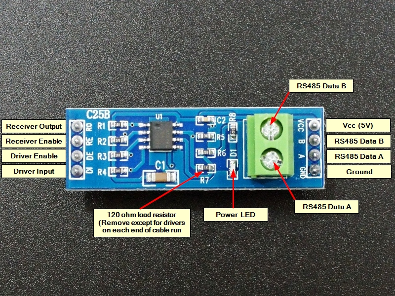

# JK-BMS-PB-CAN

## External component

[JK_RS485](https://github.com/txubelaxu/esphome-jk-bms/blob/main/components/jk_rs485_bms/README.md) by [@txubelaxu](https://github.com/txubelaxu)

## ESP32 board

- [Atom S3 - SKU:C123](https://docs.m5stack.com/en/core/AtomS3)
- [Atom S3 board config file](../../packages/board/board_atom-s3-display.yaml)
- [Atom S3 Lite - SKU:C124](https://docs.m5stack.com/en/core/AtomS3%20Lite)
- [Atom S3 Lite board config file](../../packages/board/board_atom-s3-lite.yaml)
- [Atomic CAN Base - SKU:A103](https://docs.m5stack.com/en/atom/Atomic%20CAN%20Base)

## RS485 board

This board is the one used by [@txubelaxu](https://github.com/txubelaxu) the developer of the RS485 component for the new JK-BMS PB series.<br>
This board is certainly not the best, it does not have galvanic isolation and requires a TALK PIN.



### RS485 isolated board

The board below is of better quality, it has galvanic isolation and does not require a TALK PIN but it has not yet been tested with the [@txubelaxu](https://github.com/txubelaxu) component.


[ADUM3201 B0505XT TTL to RS485 high speed dual version (Aliexpress link)](https://www.aliexpress.com/item/1005004945951447.html)

## Schematic and setup instructions

```
                               CONVERTER                           UART-TTL
┌──────────┐                 ┌───────────┐                       ┌──────────┐
│          │<-RJ45-P1 ----A->│   UART    │<-VCC--------------5V--│          │<---5V
│  JK-BMS  │<-RJ45-P2-----B->│    TO     │                       │   ESP32  │
│          │                 │   RS485   │<-DI-----------TX--G1--│  ATOM S3 │--G5--> CAN TX (Atomic CAN Base)
│  RS485   │                 │           │--RO-----------RX--G2->│          │<-G6--- CAN RX (Atomic CAN Base)
│ NETWORK  │                 │ CONVERTER │<-DE--+                │          │
│          │                 │           │<-RE--└--TALK PIN--G8--│          │
│          │                 │           │                       │          │
|          |<-RJ45-P3---GND->|           |<-GND-------------GND->|          |<---GND
└──────────┘                 └───────────┘                       └──────────┘
```
- [RJ45 568A pinout](../../images/RJ45-Pinout-T568A.jpg)
- [RJ45 568B pinout](../../images/RJ45-Pinout-T568B.jpg)

## BMS DIP switch config (mode 2)

With mode 2, the sniffer (ESP32) will automatically take the address 0x00 and act as master BMS (max 15 BMS).

- BMS 1 RS485 address : 0x01
- BMS 2 RS485 address : 0x02
- BMS 3 RS485 address : 0x03
- etc.
