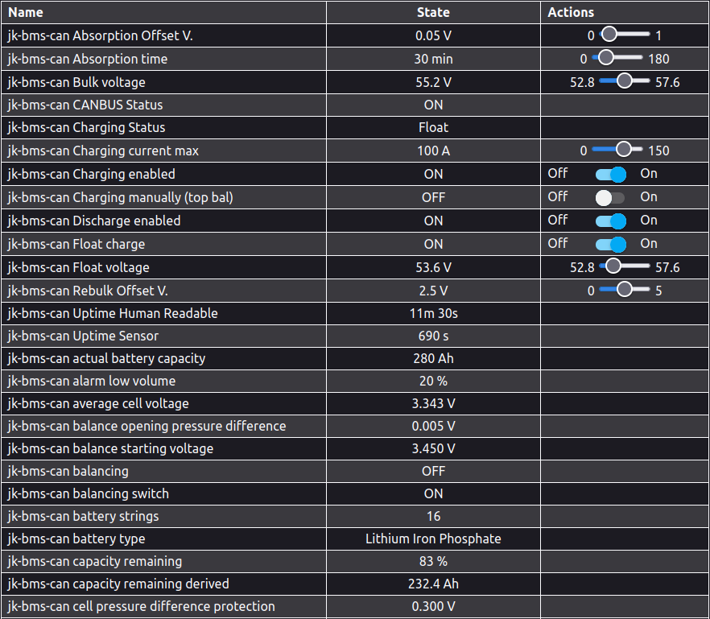

# YamBMS - Configuration of the main YAML

[](https://www.gnu.org/licenses/gpl-3.0)
[](https://github.com/Sleeper85/esphome-jk-bms-can/releases/latest)


## Home Assistant API

If your ESP32 is not connected with Home Assistant it will reboot every 15 minutes.
This is the normal behavior of ESPHome if HA is not connected to the ESP32 API.
This is not a bug to be resolved but a mechanism put in place by the ESPHome team to correct a possible problem with the API connection.

The **"api:"** section is therefore configured by default not to reboot every 15 minutes if Home Assistant is not connected.

```YAML
# +------------------------------------------------------------------+
# | ** The settings below can be modified according to your needs ** |
# +------------------------------------------------------------------+

api:
  reboot_timeout: 0s
```

## Web Server

**Please note that enabling this component will take up a lot of memory and may decrease stability and be the cause of reboot depending on the capabilities of the board used.**

If you don't use Home Assistant, you can activate the web server and have access to information coming from JK-BMS and also interact with the application.



The web server is not enabled by default.<br>
To enable this feature, uncomment the lines below in your YAML file.

```ỲAML
# +------------------------------------------------------------------+
# | ** The settings below can be modified according to your needs ** |
# +------------------------------------------------------------------+

web_server:
  port: 80
  log: false
  ota: false
```

## WiFi

By default, if the ESP32 is disconnected from the WiFi network it will reboot every 15 minutes to try to resolve the problem.<br>
If you don't want to connect the ESP32 to the WiFi network please remove the lines below in your YAML file.

```YAML
# +------------------------------------------------------------------+
# | ** The settings below can be modified according to your needs ** |
# +------------------------------------------------------------------+

wifi:
  ssid: !secret wifi_ssid
  password: !secret wifi_password
  domain: !secret domain
```
