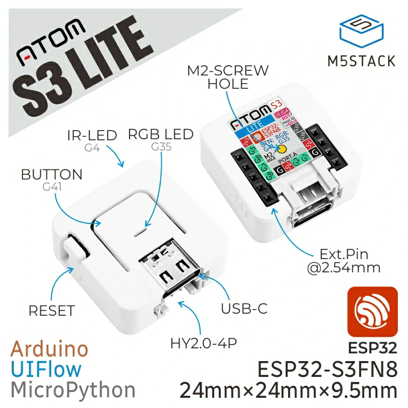

# YamBMS - M5Stack Atom S3 (ESP32-S3FN8)

## Number of BMS supported

**Warning:** Atom S3 provides very few GPIOs without UART expander. BMS monitoring with `UART` or `RS485` is recommended.

* 3x BMS with `Bluetooth` (BLE stack consumes significant amount of RAM on device and can cause crash and reboot)
* 2x `JK-B` BMS with `UART` (the second UART must be soldered on the Atomic CAN base on GPIOs G7 and G8)
* several `JK-PB` BMS with `RS485` (already tested with 7 BMS)

Note: these are theoretical limits, not all combinations have been tested.

## UART/IO Expander

Theoretically, with the 4 GPIOs available, it would be possible to add one [WK2168 4x UART expander](https://esphome.io/components/weikai.html) for a total of 4x `JK-B` BMS monitored with `UART`.

## M5Stack Atom CAN Kit (the Plug & Play solution)

> [!IMPORTANT] 
> If you have JK-PB series BMS (inverter BMS) and want to monitor them via RS485, please read the [README](BMS_JK-PB_RS485_solution.md) dedicated to this topic.

If soldering or creating your own board seems complicated to you, know that it is possible to use the Atom CAN Kit from M5Stack. 

**Choose Atom S3 (display) or Atom S3 Lite + Atomic CAN base.**

- [Atom S3 - SKU:C123](https://docs.m5stack.com/en/core/AtomS3)
- [Atom S3 Lite - SKU:C124](https://docs.m5stack.com/en/core/AtomS3%20Lite)
- [Atomic CAN Base - SKU:A103](https://docs.m5stack.com/en/atom/Atomic%20CAN%20Base)

| Atomic S3 Lite | Atomic CAN Base |
| --- | --- |
|  |  |
