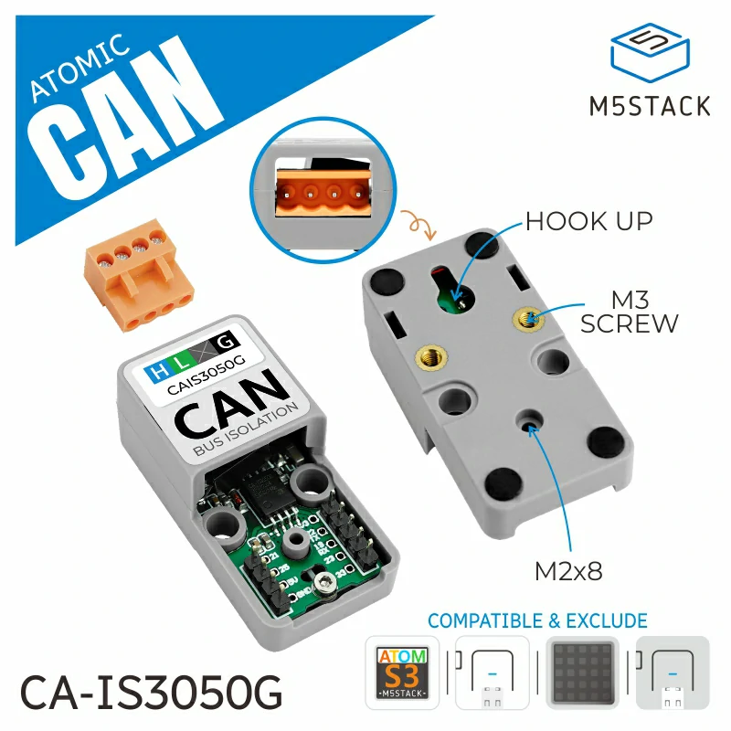

# YamBMS - M5Stack Atom S3

## Buy the M5Stack Atom CAN Kit (the Plug & Play solution)

**Warning: Atom S3 provides very few GPIOs, this solution can work to monitor up to 3x BMS with `Bluetooth`, 2x BMS (JK-B) with `UART` (the second UART must be soldered on the Atomic CAN base on GPIOs G7 and G8) or several BMS (JK-PB) with `RS485` (already tested with 7 BMS).**

If soldering or creating your own board seems complicated to you, know that it is possible to use the Atom CAN Kit from M5Stack. 

**Choose Atom S3 (display) or Atom S3 Lite + Atomic CAN base.**

- [Atom S3 - SKU:C123](https://docs.m5stack.com/en/core/AtomS3)
- [Atom S3 Lite - SKU:C124](https://docs.m5stack.com/en/core/AtomS3%20Lite)
- [Atomic CAN Base - SKU:A103](https://docs.m5stack.com/en/atom/Atomic%20CAN%20Base)

| Atomic S3 Lite | Atomic CAN Base |
| --- | --- |
|  |  |
