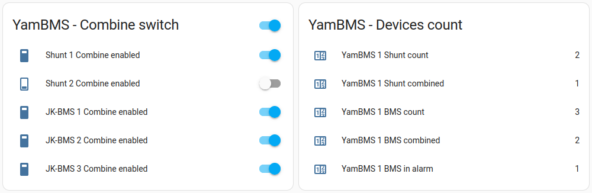

# YamBMS behavior

## Shunt and BMS combination

### Shunt

Combine condition :
1) the `Combine` switch is enabled
2) the `Voltage` supplied by the shunt `is > 0V`

If one of these two conditions is not respected, the shunt is automatically decombined.

As soon as you import a `shunt` and it can be combined (see condition) the values ​​(Voltage, Current, Power and SoC) of the shunt(s) will take precedence over the BMS values.

### BMS

Combine condition :
1) the `Combine` switch is enabled
2) BMS `Charging` or `Discharging` switch is enabled
3) BMS is not in `alarm`

If one of these three conditions is not met, the BMS is automatically decombined.

## BMS alarms

> [!IMPORTANT]  
> This is the current behavior, it may not be perfect, feel free to communicate your ideas to improve it.

The `errors_bitmask` values ​​are merged and then analyzed continuously **even if the BMS is uncombined**.

As long as at least one BMS is working normally the system will continue to work.
YamBMS will display BMS alarms as `Warning`.

If all BMS are in alarm, they are all uncombined and in this case the sending of instructions on the `CAN bus` is also stopped.
YamBMS will display BMS alarms as `Alarm`.