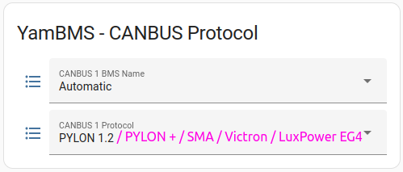
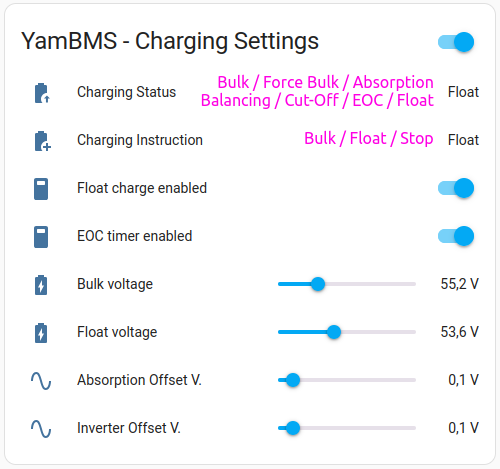
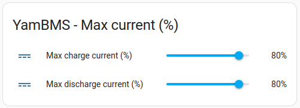
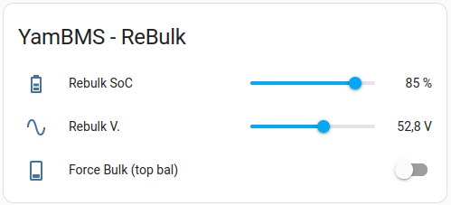
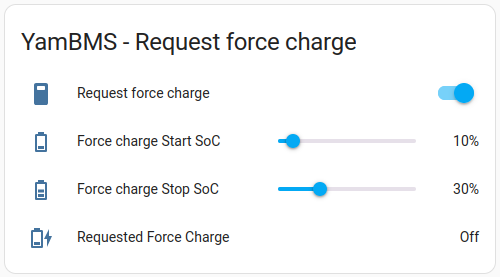
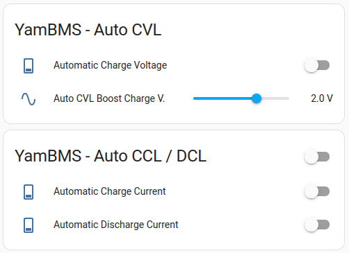
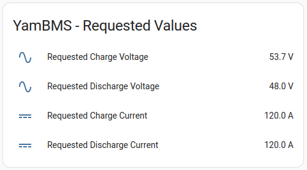
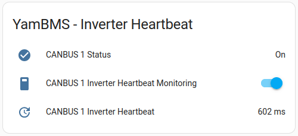
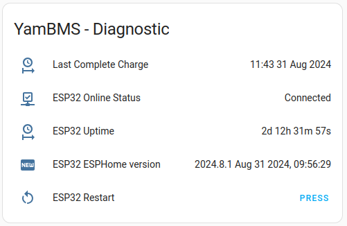
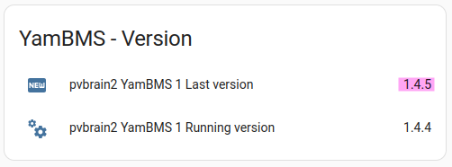

# YamBMS functions

## CAN protocol

> [!IMPORTANT]  
> You need to check if your inverter model is on the list of [supported inverters](Supported_devices.md#supported-inverter). In any case it must support one of the following `CAN` bus protocols.

Choose the CAN protocol that will be sent to your inverter and don't forget to configure your inverter for the protocol you choose.

The table below helps you choose the best protocol depending on your inverter brand.
Other configurations are possible, don't hesitate to communicate what works well for you.

| Inverter | Battery mode | CAN protocol |
| --- | --- | --- |
| Deye | Lithium 00 | PYLON 1.2 |
| GoodWe | LX U5.4-L | PYLON + |
| Sofar | Automatic | PYLON 1.2 |
| Growatt | CAN L52 | PYLON 1.2 |
| Solis | AoBo | SMA |
| LuxPower | Lithium 6 | LuxPower |
| EG4 | Lithium 6 | LuxPower |
| Victron | ESS | Victron |
| SMA | - | SMA |

## Charging settings

The `Charging status` represents the current charging phase, see the [Charging logic](Charging_logic.md).

The `Charging instruction` is defined based on the `Charging status` and allows the correct `Requested Charge Values` ​​to be sent.

The `Float charge enabled` switch allows the battery to be kept fully charged at the end of the `Bulk` charge. The voltage used will be that of the `Float volatge` slider.

The `EOC timer enabled` switch ensures that the `Cut-Off` phase lasts maximum `30 min` (default value) even if your cells are still being equalized. If your cells are equalized, the `Cut-Off` phase will end at the earliest after `60s` (default value). This prevents the risk of staying in the `Cut-Off` phase for many hours if you have several batteries and they are poorly equalized.

The `Bulk voltage` slider allows you to set the voltage used during the `Bulk`, `Absorption`, `Balancing` and `Cut-Off` phases.

The `Float voltage` slider allows you to set the voltage used after charging is complete if the `Float charge enabled` switch is active.

The `Absorption Offset V.` slider has a dual purpose, it is used to display the `Absorption` status and to calculate the `Cut-Off` values, see the [Charging logic](Charging_logic.md).

The `Inverter Offset V.` slider allows you to correct the inverter charge voltage, either because it does not respect the requested value or because your inverter is far from your batteries and there is a voltage drop. This allows you to reach the target `Bulk` or `Float` charge voltage by adding an offset.

### Max current (%)

The allowed charge or discharge current is automatically calculated based on the `OCP` values ​​of your BMS. The `OCP` currents of the combined BMS (not in alarm) are added together and the requested current is a percentage `0~90%` of this value.

### ReBulk

There are two parameters to start a new `Bulk` phase. You can set a `Rebulk SoC` or a `Rebulk V.` value, only one of these conditions must be met.

If needed you can also force a `Bulk` charge with the `Force Bulk (top bal)` switch. The switch will automatically deactivate when your cells enter the `Balancing` phase.

### Request Force Charge

This function allows you to force a charge from `GRID` :
- when `SoC <= Start SoC` the forced charge start
- when `SoC >= Stop SoC` the forced charge stop

Works only with `PYLON`, `LuxPower` and `Victron` protocols.

## Auto functions

Thanks to [@MrPabloUK](https://github.com/MrPabloUK) for developing these features.

A [reference spreadsheet](https://docs.google.com/spreadsheets/d/1UwZ94Qca-DBP5gppzKmAjbMJYZGjR4lMwZtwwQR9wWY/edit?usp=sharing) has been created that shows how the `Auto functions` works.

## Auto CVL

When enabled, the `Automatic Charge Voltage Limit` feature will automatically reduce the `Requested Charge Voltage (CVL)` sent to the inverter when a cell starts to exceed the bulk target.
That way, the runner cell should be maintained at or near bulk (for example, 3.45v) and the balancer can start to bring up the lagging cells.
Controlling the CVL is the preferred option according to Victron and others, but it depends on how well your inverter behaves.
My Solis inverter is not great at CVL control, so it doesn't work well for me.

You can compare `Auto CVL` to cruise control in a car.

## Auto CCL & DCL

Regarding the new `Auto Charge/Discharge Current Limit`, this features has been introduced to hopefully prevent `OVP` and `UVP` alarms.

When enabled, the `Automatic Charge Current Limit` feature will automatically reduce the `Requested Charge Current (CCL)` sent to the inverter when a cell starts to exceed the bulk target.
This should prevent the runner cell from exceeding the max voltage cutoff, but doesn't maintain it at bulk voltage - instead it should keep it just below max cell voltage.

You can compare `Auto CCL` to a max speed limiter in a car.

`Auto DCL` works the same way when a cell approaching `UVPR`.

Current control should work with any inverter that uses `CAN` control.

## Requested Values

These 4 sensors allow you to see what is being requested of your inverter.

In the example below, we are in the `Float` phase at a voltage of `53.6V` and an `Inverter Offset V.` of `0.1V`. The `Requested Charge Voltage` is therefore `53.7V`.

The `Requested Discharge Voltage` is the `UVPR` value of your BMS multiplied by the number of cells, in this example (3V * 16).

The `Requested Chare/Discharge Current` is the `OCP` value of your BMS multiplied by the `Max current` percentage, in this example (150A * 80%).

## Inverter Heartneat

This feature allows you to monitor the heartbeat of your inverter (time between two ACK 0x305). This is useful for troubleshooting purposes and should not remain enabled continuously.

## Diagnostic

Useful information for troubleshooting.

## YamBMS version

This function lets you know if a new version of YamBMS is available, the check is done every 6 hours.

